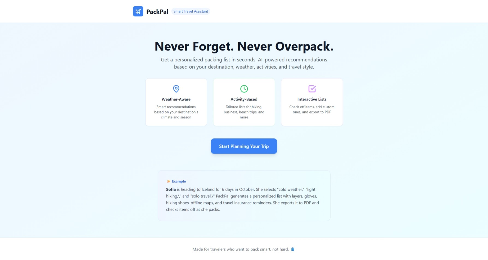
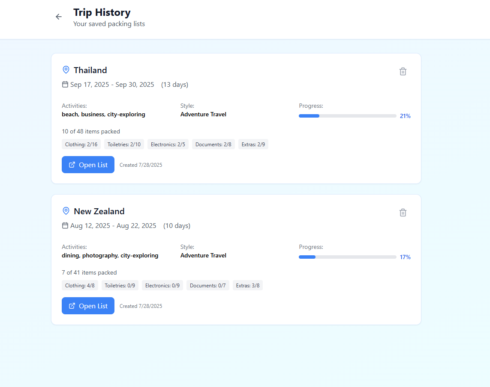

# 🚀 Day 2 – Vibe-Coded PackPal (Bolt.new Exploration)

This is my Day 2 project for the AI/LLM Engineering Bootcamp. It's a smart travel packing assistant built using **Bolt.new** with a clean **Vibe-coded UI**.

Users can plan trips by selecting their destination, travel dates, activities, and travel style. The app generates a contextual packing list using AI prompts and logic and allows users to save, export, and revisit their trips.

---

## 🌍 Live Demo

🔗 [Visit the live app on Netlify](https://radiant-granita-bdf428.netlify.app)

---

## 📸 Screenshots

### 🏠 Home Page

### 📋 Saved Packing List View

---